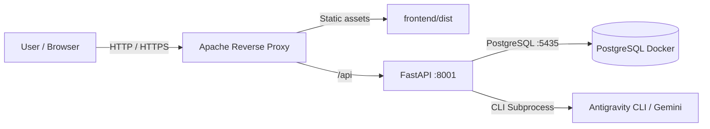

# OpoTest - AI-Powered Competitive Exam Simulator

> 🌐 **Language / Idioma:** **English** | [Español](README.es.md)

OpoTest is a web application designed to help candidates prepare for competitive civil service exams (*oposiciones*) by generating custom multiple-choice tests directly from their own study materials in PDF format.

The application allows users to upload PDF syllabuses, securely extract and persist their text, generate customized mock exams with selectable question counts and time limits, take the test in a responsive interface (desktop and mobile) with automatic progress saving, and receive instant grading along with detailed explanations for each question provided by Gemini AI.

---

## Prerequisites

Ensure you have the following installed on your machine:
1. **Docker and Docker Compose**: To run the local PostgreSQL database.
2. **Python 3.10 or higher**: To run the FastAPI backend.
3. **Node.js 18 or higher** (LTS v20+ recommended): For the React frontend.

---

## Project Structure

* `/backend`: Lightweight API server built with **FastAPI**, **SQLAlchemy**, and the **Google Gemini SDK** in Python.
* `/frontend`: Interactive single-page application built with **React (Vite)** and **Vanilla CSS** (Mobile-First design and Dark/Light Mode).
* `docker-compose.yml`: Container orchestrator to spin up a local **PostgreSQL** database instance.

---

## Quickstart & Local Setup

Follow these steps in your terminal to get the full stack up and running:

### Step 1: Start the Database (Docker)
From the project root directory, run:
```bash
docker compose up -d
```
*This starts a container named `opotest-db` listening on local port `5435` with persistent volume storage.*

### Step 2: Configure and Start the Backend (Python)
1. Open a terminal tab and navigate to the `backend/` directory:
   ```bash
   cd backend
   ```
2. Create a Python virtual environment:
   ```bash
   python3 -m venv venv
   ```
3. Activate the virtual environment:
   - On macOS / Linux:
     ```bash
     source venv/bin/activate
     ```
   - On Windows (PowerShell):
     ```bash
     .\venv\Scripts\Activate.ps1
     ```
4. Install dependencies:
   ```bash
   pip install -r requirements.txt
   ```
5. **Configure environment variables**:
   Copy the example environment file and adjust variables if needed:
   ```bash
   cp .env.example .env
   ```
6. Start the development server:
   ```bash
   uvicorn app.main:app --reload --port 8001
   ```
   *The backend is now available at `http://localhost:8001`. You can view interactive OpenAPI documentation at `http://localhost:8001/docs`.*

### Step 3: Start the Frontend (React)
1. Open another terminal tab and navigate to the `frontend/` directory:
   ```bash
   cd frontend
   ```
2. Install Node dependencies:
   ```bash
   npm install
   ```
3. Start the Vite development server:
   ```bash
   npm run dev
   ```
4. Open your browser at the displayed URL (default is `http://localhost:5173`).

---

## Production Deployment

The following guide details how to deploy OpoTest on a dedicated production server using **Apache 2 as a Reverse Proxy**, covering both **Linux (Ubuntu/Debian)** and **macOS Server**.



---

### Option A: Linux Server (Ubuntu / Debian)

#### 1. Clone the repository and start the database
From your target installation folder (e.g. `/var/www/opotest`):
```bash
git clone <REPOSITORY_URL> /var/www/opotest
cd /var/www/opotest
docker compose up -d
```

#### 2. Configure the Backend (Python)
1. Set up the virtual environment and install requirements:
   ```bash
   cd /var/www/opotest/backend
   python3 -m venv venv
   source venv/bin/activate
   pip install -r requirements.txt
   cp .env.example .env
   ```
2. Create a systemd service to manage the backend lifecycle:
   ```bash
   sudo nano /etc/systemd/system/opotest-backend.service
   ```
3. Add the following unit configuration (adjust `User` and paths accordingly):
   ```ini
   [Unit]
   Description=OpoTest Backend API (FastAPI)
   After=network.target docker.service

   [Service]
   User=www-data
   Group=www-data
   WorkingDirectory=/var/www/opotest/backend
   ExecStart=/var/www/opotest/backend/venv/bin/uvicorn app.main:app --host 127.0.0.1 --port 8001 --workers 2
   Restart=always
   RestartSec=5
   EnvironmentFile=/var/www/opotest/backend/.env

   [Install]
   WantedBy=multi-user.target
   ```
4. Enable and start the service:
   ```bash
   sudo systemctl daemon-reload
   sudo systemctl enable opotest-backend
   sudo systemctl start opotest-backend
   ```

#### 3. Build the Frontend
```bash
cd /var/www/opotest/frontend
npm install
npm run build
```
*Production-ready static files will be placed into `/var/www/opotest/frontend/dist`.*

#### 4. Configure Apache 2 on Linux
1. Install Apache and enable required proxy and rewrite modules:
   ```bash
   sudo apt update
   sudo apt install apache2 -y
   sudo a2enmod proxy proxy_http rewrite headers ssl
   ```
2. Create the VirtualHost configuration file:
   ```bash
   sudo nano /etc/apache2/sites-available/opotest.conf
   ```
3. Add the following VirtualHost configuration:
   ```apache
   <VirtualHost *:80>
       ServerName yourdomain.com
       DocumentRoot /var/www/opotest/frontend/dist

       # Allow large PDF uploads (50MB)
       LimitRequestBody 52428800

       # Reverse Proxy to FastAPI Backend
       ProxyPreserveHost On
       ProxyRequests Off
       ProxyPass /api/ http://127.0.0.1:8001/api/ timeout=600 retry=0
       ProxyPassReverse /api/ http://127.0.0.1:8001/api/

       # SPA Routing (React Router / HTML5 History fallback)
       <Directory /var/www/opotest/frontend/dist>
           Options -Indexes +FollowSymLinks
           AllowOverride All
           Require all granted

           RewriteEngine On
           RewriteCond %{REQUEST_FILENAME} !-f
           RewriteCond %{REQUEST_FILENAME} !-d
           RewriteRule ^ index.html [L]
       </Directory>

       ErrorLog ${APACHE_LOG_DIR}/opotest_error.log
       CustomLog ${APACHE_LOG_DIR}/opotest_access.log combined
   </VirtualHost>
   ```
4. Enable the site and restart Apache:
   ```bash
   sudo a2ensite opotest.conf
   sudo a2dissite 000-default.conf
   sudo apache2ctl configtest
   sudo systemctl restart apache2
   ```

---

### Option B: macOS Server (Mac mini / Local macOS Server)

#### 1. Clone the repository and start the database
From your target folder (e.g. `~/Sites/opotest`):
```bash
git clone <REPOSITORY_URL> ~/Sites/opotest
cd ~/Sites/opotest
docker compose up -d
```

#### 2. Configure the Backend (Python)
1. Set up virtual environment and dependencies:
   ```bash
   cd ~/Sites/opotest/backend
   python3 -m venv venv
   source venv/bin/activate
   pip install -r requirements.txt
   cp .env.example .env
   ```
2. Use **PM2** to manage the process in the background across reboots:
   ```bash
   npm install -g pm2
   pm2 start "venv/bin/uvicorn app.main:app --host 127.0.0.1 --port 8001" --name opotest-backend
   pm2 startup
   pm2 save
   ```

#### 3. Build the Frontend
```bash
cd ~/Sites/opotest/frontend
npm install
npm run build
```

#### 4. Configure Apache on macOS (Homebrew)
1. Install Apache via Homebrew:
   ```bash
   brew install httpd
   ```
2. Open `/opt/homebrew/etc/httpd/httpd.conf` (or `/usr/local/etc/httpd/httpd.conf` on Intel) and uncomment:
   ```apache
   LoadModule proxy_module lib/httpd/modules/mod_proxy.so
   LoadModule proxy_http_module lib/httpd/modules/mod_proxy_http.so
   LoadModule rewrite_module lib/httpd/modules/mod_rewrite.so
   LoadModule headers_module lib/httpd/modules/mod_headers.so
   ```
   And ensure the virtual host include line is uncommented:
   ```apache
   Include /opt/homebrew/etc/httpd/extra/httpd-vhosts.conf
   ```
3. Edit `/opt/homebrew/etc/httpd/extra/httpd-vhosts.conf`:
   ```apache
   <VirtualHost *:8080>
       ServerName localhost
       # Replace YOUR_USERNAME with your macOS username
       DocumentRoot "/Users/YOUR_USERNAME/Sites/opotest/frontend/dist"

       LimitRequestBody 52428800

       ProxyPreserveHost On
       ProxyRequests Off
       ProxyPass /api/ http://127.0.0.1:8001/api/ timeout=600 retry=0
       ProxyPassReverse /api/ http://127.0.0.1:8001/api/

       <Directory "/Users/YOUR_USERNAME/Sites/opotest/frontend/dist">
           Options -Indexes +FollowSymLinks
           AllowOverride All
           Require all granted

           RewriteEngine On
           RewriteCond %{REQUEST_FILENAME} !-f
           RewriteCond %{REQUEST_FILENAME} !-d
           RewriteRule ^ index.html [L]
       </Directory>

       ErrorLog "/opt/homebrew/var/log/httpd/opotest_error.log"
       CustomLog "/opt/homebrew/var/log/httpd/opotest_access.log" combined
   </VirtualHost>
   ```
4. Restart Apache:
   ```bash
   brew services restart httpd
   ```

---

## Features & Usability

* **Dark / Light Theme**: Toggle seamlessly between visual themes with the ☀️/🌙 switch in the navbar.
* **Automatic Autosave**: Test progress and countdown timers are saved every 10 seconds and upon each answer change.
* **Pause & Resume**: Pause exams at any moment and resume them right where you left off from the "Historial" view.
* **Responsive Mobile UI**: Optimized layout with enlarged touch targets and quick-navigation drawers on small screens.

---

## License

This project is licensed under the **GNU Affero General Public License v3.0 (AGPL-3.0)**. See the [LICENSE](LICENSE) file for details.
